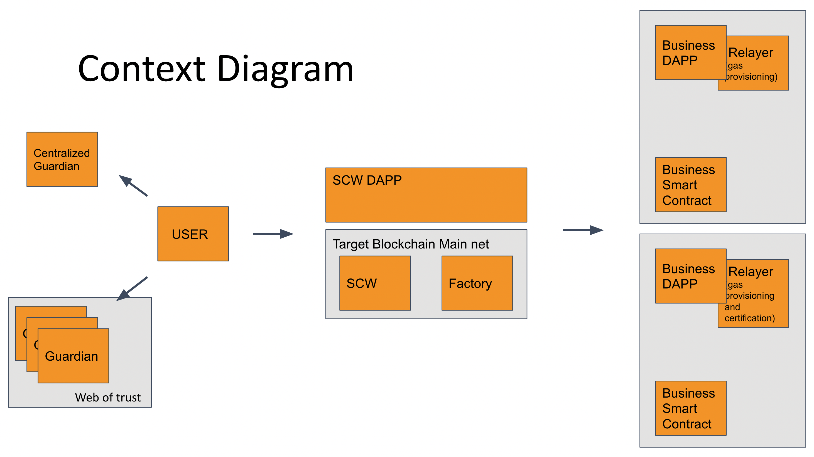

# Smart Contract Wallet (Contracts)

## Overview

At the core of the project is the aim to achieve security and transparency, whilst preserving full control of the user. The model uses a web of trust approach to protect user's data by allowing for account freeze and key recovery from preselected guardian accounts set by the user. We encorage the reader to dive into the code and get familiar with the extensive security checks that enable a safe user experience.

Below is a summary of the [roles](#roles) and [functionalities](#functionalities) that the contracts expose.

We also provide a [factory](#factory) contract to instantiate the SCW,
this allows service providers to hep users instantiate SCW and keep track of the wallets they potentially are guardians / relayers of.

[cw-1 specifications]: (https://crates.io/crates/cw1)

### Roles

There are 3 roles in a SCW:

1. _user:_ the address that this wallet services, they have full control over the roles assignment and wallet operations
1. _guardians:_ the addresses appointed by the user to protect the user (via key recovery and / or account freezing)
1. _relayers_ the addresses appointed by the user to allow for user's off-chain transaction signatures be committed on-chain with gas.

### Functionalities

#### User

1. Execute any transactions and functions on the SCW
1. Appoint guardians and relayers
1. Set guardians multisig requirements according to [cw-3 specifications](https://github.com/CosmWasm/cw-plus/blob/main/packages/cw3/README.md)

[cw-3 specifications]: (https://crates.io/crates/cw3)

#### Guardians

Given the multisig requirements for guardians are reached,
guardians can:

1. Freeze account (in the case where user has lost their keys / device stolen)
1. Rotate user key (in the case user wants to set a new key)

#### Relayers

1. Relay user signature by sending it as payload and paying for gas cost
1. (Optional) Adding payload data of a set size if signature is valid (for regulatory purpose)

### User Signature

The type of signature supported is [`secp256k1`](https://en.bitcoin.it/wiki/Secp256k1) and the message is in the format of a `CosmosMsg`.

For example, in TypeScript:

```ts
const sendMsg: BankMsg = {
  bank: {
    send: {
      to_address: adminAddr!,
      amount: [some_coin],
    },
  },
};

const messageHash = sha256(toUtf8(JSON.stringify(sendMsg)));
const signature = (
  await Secp256k1.createSignature(messageHash, keypair.privkey)
).toFixedLength();
```

### Factory

The factory contains the `code_id` used to instantiate SCW instances.
After instantiation, the new SCW address is stored in the factory contract.

We have tested the Factory functionality [here](/../../blob/main/contracts/factory/src/contract.rs#L302).

## Wasm events attributes Keys

- `action`: response to a message call by user for features
- `config`: response to a message call by admin / user for configuration (i.e. new `proxy_code_id`)

## Context Diagram


